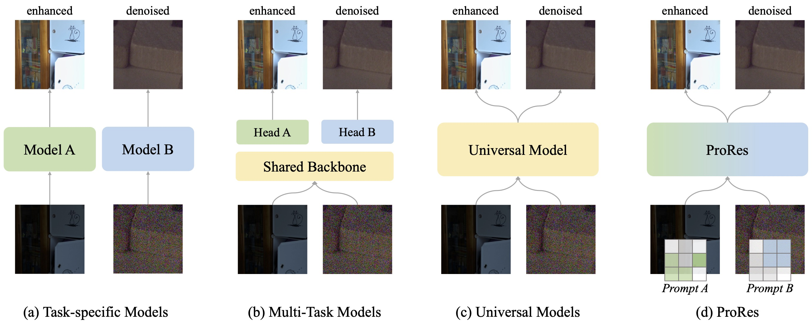
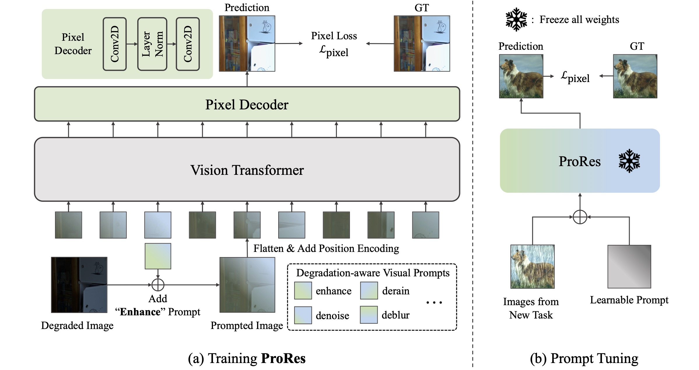

<div align="center">
<h1> ProRes 🌆</h1>
<h3> Exploring Degradation-aware Visual <strong>Pro</strong>mpt for Universal Image <strong>Res</strong>toration </h3>

[Jiaqi Ma](https://scholar.google.com/citations?user=BJUlpoMAAAAJ)<sup>1,✢</sup>,
[Tianheng Cheng](https://scholar.google.com/citations?user=PH8rJHYAAAAJ)<sup>2,✢</sup>,
[Guoli Wang](https://scholar.google.com/citations?user=z-25fk0AAAAJ)<sup>3</sup>,
[Xinggang Wang](https://scholar.google.com/citations?user=qNCTLV0AAAAJ)<sup>2</sup>, 
[Qian Zhang](https://scholar.google.com/citations?user=pCY-bikAAAAJ)<sup>3</sup>,
[Lefei Zhang](https://scholar.google.com/citations?user=BLKHwNwAAAAJ)<sup>1,📧</sup>

<sup>1</sup>School of Computer Science, Wuhan University\
<sup>2</sup> School of EIC, Huazhong University of Science & Technology\
<sup>3</sup> Horizon Robotics

(✢) Equal contribution.
(📧) corresponding author.

[](https://arxiv.org/abs/2306.13653)

</div>

<!-- <div align="left">   

## ProRes: Exploring Degradation-aware Visual **Pro**mpt for Universal Image **Res**toration 
(This page is under construction.)
> [ProRes: Exploring Degradation-aware Visual **Pro**mpt for Universal Image **Res**toration](https://arxiv.org/abs/)\
> by Jiaqi Ma<sup>1*</sup>, Tianheng Cheng<sup>2*</sup>, Guoli Wang<sup>3</sup>, Qian Zhang<sup>3</sup>, Xinggang Wang<sup>2</sup>, Lefei Zhang<sup>1#</sup>\
><sup>1</sup> School of Computer Science, Wuhan University <sup>2</sup> School of EIC, Huazhong University of Science \& Technology <sup>3</sup> Horizon Robotics\
><sup>*</sup> Equal contribution \
><sup>#</sup> Corresponding author
>
>*The latest arXiv version ([ProRes](https://arxiv.org/abs/))*
---
[中文文档](https://github.com/leonmakise/ProRes/README_CH.md) -->

<!-- ### The Illustration of ProRes
 -->

<!-- <p align="center">
  
</p> -->

## Updates
This project is under active development, please stay tuned! ☕

**Sep 29, 2024:** Code & models of ProRes are released, and some minor issues have been fixed. We will update the arXiv version with more details upon acceptance.

**Aug 28, 2024:** Our newest paper [Perceive-IR](https://arxiv.org/abs/2408.15994) is on arXiv and under peer review! Perceive-IR performs well under two all-in-one settings.

**Jun 26, 2023:** We've released [ProRes](https://arxiv.org/abs/2306.13653)! We wish this work would inspire more works on prompt learning with image restoration tasks. Code & models are coming soon!


## Highlights


* ProRes addresses universal image restoration with degradation-aware prompts, which is the first prompt-based versatile framework for image restoration.

* ProRes demonstrate two superior capabilities: (1) control ability for desired outputs and (2) transferability based on prompt tuning.

* ProRes can be easily adapted for new tasks or new datasets through effective and efficient prompt tuning.

* Specific prompts can control the output of ProRes. Moreover, combining different prompts can tackle the images with multiple corruptions.

## Getting Started

### Requirement
* Linux, CUDA>=9.2, GCC>=5.4
* PyTorch >= 1.8.1
* MATLAB for evaluation


### Other Dependencies
Install [detectron2](https://github.com/facebookresearch/detectron2), following the instructions in [here](https://detectron2.readthedocs.io/en/latest/tutorials/install.html). 
Or simply use the following command.
```bash
cd ProRes/
git clone https://github.com/facebookresearch/detectron2
python -m pip install -e detectron2
```

### Data Preparation
#### Download Path
- Download the denoising dataset from [SIDD](https://www.eecs.yorku.ca/~kamel/sidd/).
- Download the low-light enhancement dataset from [LoL](https://daooshee.github.io/BMVC2018website/). 
- Download the deraining dataset from [Synthetic Rain Datasets](https://github.com/swz30/MPRNet/blob/main/Deraining/Datasets/README.md). 
- Download the deblurring dataset from [Synthetic Blur Datasets](https://github.com/swz30/MPRNet/blob/main/Deblurring/Datasets/README.md). 

#### Preprocess Data
Run the following commands to generate corresponding JSON files for each dataset.

```bash
#denoising
python data/sidd/gen_json_sidd.py --split train
python data/sidd/gen_json_sidd.py --split val

# low-light enhancement
python data/lol/gen_json_lol.py --split train
python data/lol/gen_json_lol.py --split val

# deraining
python data/derain/gen_json_rain.py --split train
python data/derain/gen_json_rain.py --split val

# derblurring
python data/derain/gen_json_blur.py --split train
python data/derain/gen_json_blur.py --split val
```

#### Dataset Structure
We recommend the dataset directory structure to be the following:

```bash
$ProRes/datasets/
    denoise/
        train/
        val/
    enhance/
        our485/
            low/
            high/
        eval15/
            low/
            high/
    derain/
        train/
            input/
            target/
        test/
            Rain100H/
            Rain100L/
            Test100/
            Test1200/
            Test2800/
    deblur/
        train/
            input/
            target/
        test/
            GoPro/
            HIDE/
            RealBlur_J/
            RealBlur_R/

    target-derain_train.json
    gt-enhance_lol_train.json
    groundtruth-denoise_ssid_train448.json
    groundtruth_crop-deblur_gopro_train.json
    
    target-derain_test_rain100h.json
    gt-enhance_lol_eval.json
    groundtruth-denoise_ssid_val256.json
    groundtruth-deblur_gopro_val.json
```

### Training
Download pre-trained [MAE ViT-Large model](https://dl.fbaipublicfiles.com/mae/pretrain/mae_pretrain_vit_large.pth) and put it in the folder `./ProRes/pretrained_weights/`.

```shell
sh scripts/train.sh
```


### Evaluation
Download the [pretrained model](https://drive.google.com/file/d/1P-MGgYtXJR214rBCD_LNZYrfQwDbSWGJ/view?usp=sharing) and put it in the folder `./ProRes/models/prores_vitl_pretrained_sl1_mprnetprompt_add/`.

Run the following command:
```shell
sh eval_ours.sh
```


## Experimental Results
<!-- [](https://paperswithcode.com/sota/traffic-object-detection-on-bdd100k?p=yolop-you-only-look-once-for-panoptic-driving) -->

#### Performance on Image Restorations Tasks
<table class="tg">
<thead>
  <tr>
    <th class="tg-c3ow" rowspan="3"></th>
    <th class="tg-c3ow" colspan="2" align="center">denoising</th>
    <th class="tg-c3ow" colspan="2" align="center">deraining</th>
    <th class="tg-c3ow" colspan="2" align="center">enhance</th>
    <th class="tg-c3ow" colspan="2" align="center">deblurring</th>
  </tr>
  <tr>
    <th class="tg-c3ow" colspan="2" align="center">SIDD</th>
    <th class="tg-c3ow" colspan="2" align="center">5 datasets</th>
    <th class="tg-c3ow" colspan="2" align="center">LoL</th>
    <th class="tg-c3ow" colspan="2" align="center">4 datasets</th>
  </tr>
  <tr>
    <th class="tg-c3ow">PSNR</th>
    <th class="tg-c3ow">SSIM</th>
    <th class="tg-c3ow">PSNR</th>
    <th class="tg-c3ow">SSIM</th>
    <th class="tg-c3ow">PSNR</th>
    <th class="tg-c3ow">SSIM</th>
    <th class="tg-c3ow">PSNR</th>
    <th class="tg-c3ow">SSIM</th>
  </tr>
</thead>
<tbody>
  <tr>
    <td class="tg-c3ow" colspan="9" align="center">Task-specific models</td>
  </tr>
  <tr>
    <td class="tg-c3ow">Uformer</td>
    <td class="tg-c3ow">39.89</td>
    <td class="tg-c3ow">0.960</td>
    <td class="tg-c3ow">-</td>
    <td class="tg-c3ow">-</td>
    <td class="tg-c3ow">-</td>
    <td class="tg-c3ow">-</td>
    <td class="tg-c3ow">32.31</td>
    <td class="tg-c3ow">0.941</td>
  </tr>
  <tr>
    <td class="tg-c3ow">MPRNet</td>
    <td class="tg-c3ow">39.71</td>
    <td class="tg-c3ow">0.958</td>
    <td class="tg-c3ow">32.73</td>
    <td class="tg-c3ow">0.921</td>
    <td class="tg-c3ow">-</td>
    <td class="tg-c3ow">-</td>
    <td class="tg-c3ow">33.67</td>
    <td class="tg-c3ow">0.948</td>
  </tr>
  <tr>
    <td class="tg-c3ow">MIRNet-v2</td>
    <td class="tg-c3ow">39.84</td>
    <td class="tg-c3ow">0.959</td>
    <td class="tg-c3ow">-</td>
    <td class="tg-c3ow">-</td>
    <td class="tg-c3ow">24.74</td>
    <td class="tg-c3ow">0.851</td>
    <td class="tg-c3ow">-</td>
    <td class="tg-c3ow">-</td>
  </tr>
  <tr>
    <td class="tg-c3ow">Restormer</td>
    <td class="tg-c3ow">40.02</td>
    <td class="tg-c3ow">0.960</td>
    <td class="tg-c3ow">33.96</td>
    <td class="tg-c3ow">0.935</td>
    <td class="tg-c3ow">-</td>
    <td class="tg-c3ow">-</td>
    <td class="tg-c3ow">32.32</td>
    <td class="tg-c3ow">0.935</td>
  </tr>
  <tr>
    <td class="tg-c3ow">MAXIM</td>
    <td class="tg-c3ow">39.96</td>
    <td class="tg-c3ow">0.960</td>
    <td class="tg-c3ow">33.24</td>
    <td class="tg-c3ow">0.933</td>
    <td class="tg-c3ow">23.43</td>
    <td class="tg-c3ow">0.863</td>
    <td class="tg-c3ow">34.50</td>
    <td class="tg-c3ow">0.954</td>
  </tr>
  <tr>
    <td class="tg-c3ow" colspan="9" align="center">Universal models</td>
  </tr>
  <tr>
    <td class="tg-c3ow">Painter</td>
    <td class="tg-c3ow">38.88</td>
    <td class="tg-c3ow">0.954</td>
    <td class="tg-c3ow">29.49</td>
    <td class="tg-c3ow">0.868</td>
    <td class="tg-c3ow">22.40</td>
    <td class="tg-c3ow">0.872</td>
    <td class="tg-c3ow">-</td>
    <td class="tg-c3ow">-</td>
  </tr>
  <tr>
    <td class="tg-c3ow">ViT-Large</td>
    <td class="tg-c3ow">39.28</td>
    <td class="tg-c3ow">0.967</td>
    <td class="tg-c3ow">30.75</td>
    <td class="tg-c3ow">0.893</td>
    <td class="tg-c3ow">21.69</td>
    <td class="tg-c3ow">0.850</td>
    <td class="tg-c3ow">20.57</td>
    <td class="tg-c3ow">0.680</td>
  </tr>
  <tr>
    <td class="tg-c3ow">ProRes</td>
    <td class="tg-c3ow">39.28</td>
    <td class="tg-c3ow">0.967</td>
    <td class="tg-c3ow">30.67</td>
    <td class="tg-c3ow">0.891</td>
    <td class="tg-c3ow">22.73</td>
    <td class="tg-c3ow">0.877</td>
    <td class="tg-c3ow">28.03</td>
    <td class="tg-c3ow">0.897</td>
  </tr>
</tbody>
</table>

**Notes**: 
- The works we used for reference including `Uformer`([paper](https://openaccess.thecvf.com/content/CVPR2022/papers/Wang_Uformer_A_General_U-Shaped_Transformer_for_Image_Restoration_CVPR_2022_paper.pdf),[code](https://github.com/ZhendongWang6/Uformer)), `MPRNet`([paper](https://openaccess.thecvf.com/content/CVPR2021/papers/Zamir_Multi-Stage_Progressive_Image_Restoration_CVPR_2021_paper.pdf),[code](https://github.com/swz30/MPRNet)), `MIRNet-v2`([paper](https://www.waqaszamir.com/publication/zamir-2022-mirnetv2/),[code](https://github.com/swz30/MIRNetv2)), `Restormer`([paper](https://openaccess.thecvf.com/content/CVPR2022/papers/Zamir_Restormer_Efficient_Transformer_for_High-Resolution_Image_Restoration_CVPR_2022_paper.pdf),[code](https://github.com/swz30/Restormer)), `MAXIM`([paper](https://openaccess.thecvf.com//content/CVPR2022/papers/Tu_MAXIM_Multi-Axis_MLP_for_Image_Processing_CVPR_2022_paper.pdf),[code](https://github.com/google-research/maxim)) and `Painter`([paper](https://openaccess.thecvf.com/content/CVPR2023/papers/Wang_Images_Speak_in_Images_A_Generalist_Painter_for_In-Context_Visual_CVPR_2023_paper.pdf),[code](https://github.com/baaivision/Painter)).
- For both Painter and ProRes, we adopt ViT-Large with MAE pre-trained weights.
- More experimental results are listed in the paper!
---

<!-- #### ProRes and the vanilla task-specific models:


<table class="tg">
<thead>
  <tr>
    <th class="tg-c3ow" rowspan="3"></th>
    <th class="tg-c3ow" colspan="2">denoising</th>
    <th class="tg-c3ow" colspan="2">deraining</th>
    <th class="tg-c3ow" colspan="2">enhance</th>
    <th class="tg-c3ow" colspan="2">deblurring</th>
  </tr>
  <tr>
    <th class="tg-c3ow" colspan="2">SIDD</th>
    <th class="tg-c3ow" colspan="2">5 datasets</th>
    <th class="tg-c3ow" colspan="2">LoL</th>
    <th class="tg-c3ow" colspan="2">4 datasets</th>
  </tr>
  <tr>
    <th class="tg-c3ow">PSNR</th>
    <th class="tg-c3ow">SSIM</th>
    <th class="tg-c3ow">PSNR</th>
    <th class="tg-c3ow">SSIM</th>
    <th class="tg-c3ow">PSNR</th>
    <th class="tg-c3ow">SSIM</th>
    <th class="tg-c3ow">PSNR</th>
    <th class="tg-c3ow">SSIM</th>
  </tr>
</thead>
<tbody>
  <tr>
    <td class="tg-c3ow" colspan="9">Task-specific models</td>
  </tr>
  <tr>
    <th class="tg-nrix" rowspan="4">ViT-Large</th>
    <td class="tg-c3ow"><span style="font-weight:normal;font-style:normal">39.74</span></td>
    <td class="tg-c3ow"><span style="font-weight:normal;font-style:normal">0.969</span></td>
    <td class="tg-0pky">-</td>
    <td class="tg-0pky">-</td>
    <td class="tg-0pky">-</td>
    <td class="tg-0pky">-</td>
    <td class="tg-0pky">-</td>
    <td class="tg-0pky">-</td>
  </tr>
  <tr>
    <td class="tg-c3ow">-</td>
    <td class="tg-c3ow">-</td>
    <td class="tg-c3ow"><span style="font-weight:normal;font-style:normal">29.95</span></td>
    <td class="tg-c3ow"><span style="font-weight:normal;font-style:normal">0.879</span></td>
    <td class="tg-c3ow">-</td>
    <td class="tg-c3ow">-</td>
    <td class="tg-c3ow">-</td>
    <td class="tg-c3ow">-</td>
  </tr>
  <tr>
    <td class="tg-c3ow">-</td>
    <td class="tg-c3ow">-</td>
    <td class="tg-c3ow">-</td>
    <td class="tg-c3ow">-</td>
    <td class="tg-c3ow"><span style="font-weight:normal;font-style:normal">18.91</span></td>
    <td class="tg-c3ow">0.741</td>
    <td class="tg-c3ow">-</td>
    <td class="tg-c3ow">-</td>
  </tr>
  <tr>
    <td class="tg-c3ow">-</td>
    <td class="tg-c3ow">-</td>
    <td class="tg-c3ow">-</td>
    <td class="tg-c3ow">-</td>
    <td class="tg-c3ow">-</td>
    <td class="tg-c3ow">-</td>
    <td class="tg-c3ow"><span style="font-weight:normal;font-style:normal">27.51</span></td>
    <td class="tg-c3ow">0.882</td>
  </tr>
  <tr>
    <td class="tg-c3ow" colspan="9">Universal models</td>
  </tr>
  <tr>
    <td class="tg-c3ow"><span style="font-weight:400;font-style:normal;text-decoration:none">ViT-Large</span></td>
    <td class="tg-c3ow">39.28</td>
    <td class="tg-c3ow"><span style="font-weight:normal;font-style:normal">0.967</span></td>
    <td class="tg-c3ow">30.75</td>
    <td class="tg-c3ow"><span style="font-weight:400;font-style:normal;text-decoration:none">0.893</span></td>
    <td class="tg-c3ow">21.69</td>
    <td class="tg-c3ow">0.850</td>
    <td class="tg-c3ow">20.57</td>
    <td class="tg-c3ow">0.680</td>
  </tr>
  <tr>
    <td class="tg-c3ow">ProRes</td>
    <td class="tg-c3ow"><span style="font-weight:normal;font-style:normal">39.28</span></td>
    <td class="tg-c3ow"><span style="font-weight:400;font-style:normal;text-decoration:none">0.967</span></td>
    <td class="tg-c3ow">30.67</td>
    <td class="tg-c3ow">0.891</td>
    <td class="tg-c3ow">22.73</td>
    <td class="tg-c3ow">0.877</td>
    <td class="tg-c3ow">28.03</td>
    <td class="tg-c3ow">0.897</td>
  </tr>
</tbody>
</table>

--- -->
<!-- 
#### Different training strategies for ProRes with degradation-aware visual prompts:

<table class="tg">
<thead>
  <tr>
    <th class="tg-nrix" colspan="2" rowspan="2">Prompt</th>
    <th class="tg-c3ow" colspan="2">denoising</th>
    <th class="tg-c3ow" colspan="2">deraining</th>
    <th class="tg-c3ow" colspan="2">enhance</th>
    <th class="tg-c3ow" colspan="2">deblurring</th>
  </tr>
  <tr>
    <th class="tg-c3ow" colspan="2">SIDD</th>
    <th class="tg-c3ow" colspan="2">5 datasets</th>
    <th class="tg-c3ow" colspan="2">LoL</th>
    <th class="tg-c3ow" colspan="2">4 datasets</th>
  </tr>
</thead>
<tbody>
  <tr>
    <td class="tg-baqh"><span style="font-weight:normal;font-style:normal">Initialization</span></td>
    <td class="tg-c3ow"><span style="font-weight:normal;font-style:normal">Learnable</span></td>
    <td class="tg-c3ow">PSNR</td>
    <td class="tg-c3ow">SSIM</td>
    <td class="tg-c3ow">PSNR</td>
    <td class="tg-c3ow">SSIM</td>
    <td class="tg-c3ow">PSNR</td>
    <td class="tg-c3ow">SSIM</td>
    <td class="tg-c3ow">PSNR</td>
    <td class="tg-c3ow">SSIM</td>
  </tr>
  <tr>
    <td class="tg-baqh"><span style="font-weight:normal;font-style:normal">Random</span></td>
    <td class="tg-c3ow"><span style="font-weight:normal;font-style:normal">Learnable</span></td>
    <td class="tg-c3ow">39.24</td>
    <td class="tg-c3ow">0.966</td>
    <td class="tg-c3ow"><span style="font-weight:400;font-style:normal;text-decoration:none">29.98</span></td>
    <td class="tg-c3ow"><span style="font-weight:400;font-style:normal;text-decoration:none">0.881</span></td>
    <td class="tg-c3ow"><span style="font-weight:400;font-style:normal;text-decoration:none">10.60</span></td>
    <td class="tg-c3ow"><span style="font-weight:400;font-style:normal;text-decoration:none">0.417</span></td>
    <td class="tg-c3ow">26.19</td>
    <td class="tg-c3ow">0.844</td>
  </tr>
  <tr>
    <td class="tg-baqh"><span style="font-weight:normal;font-style:normal">Random</span></td>
    <td class="tg-c3ow"><span style="font-weight:normal;font-style:normal">Detached</span></td>
    <td class="tg-c3ow">39.14</td>
    <td class="tg-c3ow"><span style="font-weight:400;font-style:normal;text-decoration:none">0.966</span></td>
    <td class="tg-c3ow">29.98</td>
    <td class="tg-c3ow">0.877</td>
    <td class="tg-c3ow">22.02</td>
    <td class="tg-c3ow">0.819</td>
    <td class="tg-c3ow">28.10</td>
    <td class="tg-c3ow"><span style="font-weight:400;font-style:normal;text-decoration:none">0.898</span></td>
  </tr>
  <tr>
    <td class="tg-baqh"><span style="font-weight:normal;font-style:normal">Pre-trained</span></td>
    <td class="tg-c3ow">Learnable</td>
    <td class="tg-c3ow">39.26</td>
    <td class="tg-c3ow">0.967</td>
    <td class="tg-c3ow"><span style="font-weight:400;font-style:normal;text-decoration:none">30.20</span></td>
    <td class="tg-c3ow"><span style="font-weight:400;font-style:normal;text-decoration:none">0.884</span></td>
    <td class="tg-c3ow">22.47</td>
    <td class="tg-c3ow">0.876</td>
    <td class="tg-c3ow">27.83</td>
    <td class="tg-c3ow">0.891</td>
  </tr>
  <tr>
    <td class="tg-baqh"><span style="font-weight:400;font-style:normal;text-decoration:none">Pre-trained</span></td>
    <td class="tg-c3ow"><span style="font-weight:normal;font-style:normal">Detached</span></td>
    <td class="tg-c3ow"><span style="font-weight:normal;font-style:normal">39.28</span></td>
    <td class="tg-c3ow"><span style="font-weight:400;font-style:normal;text-decoration:none">0.967</span></td>
    <td class="tg-c3ow">30.67</td>
    <td class="tg-c3ow">0.891</td>
    <td class="tg-c3ow">22.73</td>
    <td class="tg-c3ow">0.877</td>
    <td class="tg-c3ow">28.03</td>
    <td class="tg-c3ow">0.897</td>
  </tr>
</tbody>
</table>
  
--- -->


<!-- #### Prompt tuning on the FiveK and RESIDE-6K datasets:

<table class="tg">
<thead>
  <tr>
    <th class="tg-9wq8" rowspan="3">Methods</th>
    <th class="tg-9wq8" colspan="2">Enhancement</th>
    <th class="tg-9wq8" colspan="2">Dehazing</th>
  </tr>
  <tr>
    <th class="tg-9wq8" colspan="2">FiveK</th>
    <th class="tg-9wq8" colspan="2">RESIDE-6K</th>
  </tr>
  <tr>
    <th class="tg-9wq8">PSNR</th>
    <th class="tg-9wq8">SSIM</th>
    <th class="tg-9wq8">PSNR</th>
    <th class="tg-9wq8">SSIM</th>
  </tr>
</thead>
<tbody>
  <tr>
    <td class="tg-9wq8"><span style="font-weight:400;font-style:normal;text-decoration:none">ProRes </span>w/o Prompt Tuning</td>
    <td class="tg-9wq8">18.94</td>
    <td class="tg-9wq8"><span style="font-weight:400;font-style:normal;text-decoration:none">0.815</span></td>
    <td class="tg-9wq8">-</td>
    <td class="tg-9wq8">-</td>
  </tr>
  <tr>
    <td class="tg-9wq8"><span style="font-weight:400;font-style:normal;text-decoration:none">ProRes w/ Prompt Tuning</span></td>
    <td class="tg-9wq8">22.78</td>
    <td class="tg-9wq8">0.839</td>
    <td class="tg-9wq8">21.47</td>
    <td class="tg-9wq8">0.840</td>
  </tr>
</tbody>
</table> -->

## Visualizations

### Control Ability
#### 1.Independent Control
Visualization results processed from images of different corruptions. Compared with the original inputs, the outputs are consistent with the given visual prompts.


#### 2. Sensitive to Irrelevant Task-specific Prompts
Visualization results processed by different prompts. Compared with the original inputs, the outputs remain unchanged with irrelevant visual prompts.


#### 3. Tackle Complicated Corruptions
Visualization results processed by ProRes from images of mixed types of degradation, i.e., low-light and rainy. ProRes adopts two visual prompts for low-light enhancement (E) and deraining (D) and combines the two visual prompts by linear weighted sum, i.e., αD + (1 − α)E, to control the restoration process.


### Adaptation on New Datasets & Task
#### 1. Low-light Enhancement Results
Visualization results of ProRes on the FiveK dataset. We adopt two settings, i.e., direct inference and prompt tuning, to evaluate ProRes on the FiveK dataset (a new dataset for low-light enhancement).

#### 2. Dehazing Results
Visualization results of ProRes on the RESIDE-6K dataset via prompt tuning for image dehazing (a new task).


## Citation

If you find our paper and code useful for your research, please consider giving a star :star:   and citation :pencil: :

```BibTeX
@article{
      title={ProRes: Exploring Degradation-aware Visual Prompt for Universal Image Restoration}, 
      author={Jiaqi Ma and Tianheng Cheng and Guoli Wang and Xinggang Wang and Qian Zhang and Lefei Zhang},
      journal={arXiv preprint arXiv:2306.13653},
      year={2023}
}
```

## Acknowledgement
This project is based on [MAE](https://github.com/facebookresearch/mae), [BEiT](https://github.com/microsoft/unilm/tree/master/beit), [MIRNet](https://github.com/swz30/MIRNet), [MPRNet](https://github.com/swz30/MPRNet), [Uformer](https://github.com/ZhendongWang6/Uformer) and [Painter](https://github.com/baaivision/Painter/tree/main/Painter). Thanks for their wonderful work!
